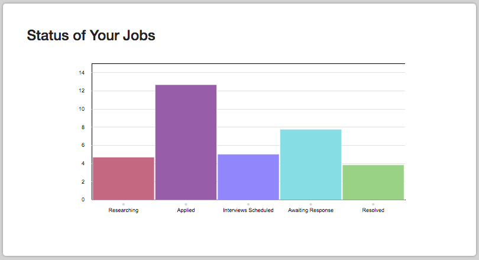
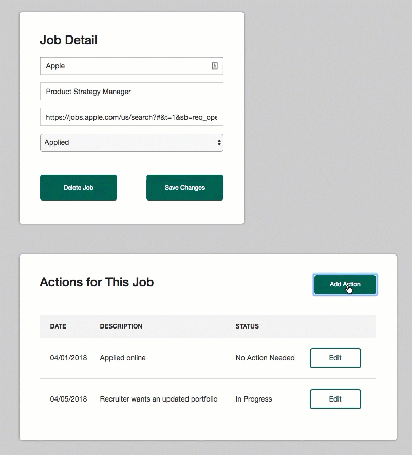
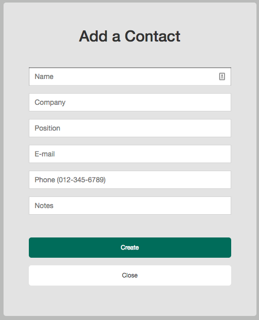

# JOByte - an app for managing your job search

With JOByte, you can track your entire job search process. You can enter a position you are interested in pursuing, note where you are in the hiring process, log recruiter interactions, and link actions items with a job.

Rather than manage you job candidacy information on disorganized sticky notes or a spreadsheet, use the JOByte app instead.

Try it at https://jobyte.herokuapp.com/.

## Get started

After you create an account and sign in, start on your dashboard and add a job. The dashboard is your central location to see the overall view of your job search in a graph, as well as a complete listing of the jobs you have added to JOByte.

## Add a job and actions

To add a job, you need to enter a company, position title, and link to the positing, and choose a status, such as Applied or Interviewing. After you add a job to your account, you can view it and make changes to it, including updating the status.

Each job can have actions related to it. An action has a date, and could be used to track past and future interactions about a particular job. For example, you can use an action to record the date you applied to a position, and then make an entry about any status updates you have with a company. You can also use actions to track required tasks, such as if a recruiter asks you to send an updated resume. After you have sent the information, mark the action completed.

 

All your actions across all jobs in JOByte appear on your monthly calendar, which you can access from the Calendar tab on the sidebar navigation panel.

## Add contacts

Because networking is a key component of a job search, you can also use JOByte to enter contact information. You might want to add contacts for recruiters, people you meet at events or are working in your desired industry, references, or any others who can help you with your job search. 

## Use on your computer or mobile device

Use JOByte in your browser on a computer or mobile device. The app is designed to be mobile-responsive, so the amount of content shown on the sidebar and on your dashboard reflects the available screen size.

## Design and architecture

This is a full-stack JavaScript MongoDB/Express/React/Node.js (MERN) app and the architecture follows a model-view-controller pattern.

On the backend, MongoDB, through Mongoose models, stores the data. There are collections for actions, contacts, jobs, and users. MongoDB was used to have more flexibility over the content than possible with a relational database.

Authentication is through email and password, with hashing and salting from `bcrypt`.

## Local set up for development purposes

These must be installed to run the app locally:

- [MongoDB](https://www.mongodb.com/)
- [Node.js](https://nodejs.org/en/)
- [npm](https://www.npmjs.com/get-npm)
- [Yarn](https://yarnpkg.com/en/)

You first need to make a local MongoDB database named `jobyte`. Then, in a terminal window, navigate into the folder where you downloaded this app and type `yarn` in the root. Repeat the `yarn` command to install in the `client` directory.

To start the app, type `yarn start` at the root and open your browser to `localhost:3000`.

## License

This project is licensed under the MIT License; see the [LICENSE.md](LICENSE) file for details

## Technology

- JavaScript, HTML, CSS
- MongoDB
- Express.js
- React
- Node.js
- various packages: [axios](https://www.npmjs.com/package/axios), [bcrypt](https://www.npmjs.com/package/bcrypt), [body-parser](https://www.npmjs.com/package/body-parser), [express](https://www.npmjs.com/package/express), [moment](https://www.npmjs.com/package/moment), [mongoose](https://www.npmjs.com/package/mongoose), [react-big-calendar](https://github.com/intljusticemission/react-big-calendar)  
- Heroku for deployment

## Authors

- [Ana Borba](https://github.com/paulakedouk)
- [John Cordano](https://github.com/johncordano)
- [Rhonda Glennon](https://github.com/rmglennon)
- [Luke Iannaccone](https://github.com/Liannaccone)
- [Rick Picolli](https://github.com/rickpicolli)

## Acknowledgments

- Thanks to Abraham, Amber, Arpad, and Jerome for support.